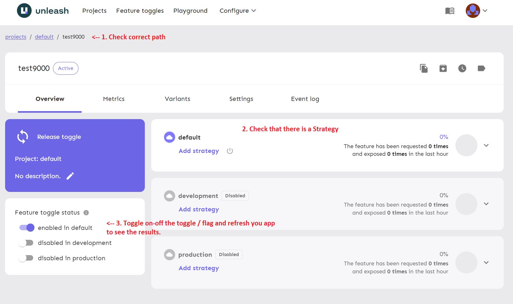

# test-feature-toggles

## Purpose of this app

I have created this small app (basically a simple TODO list) to showcase how we can use feature-toggles with Unleash.
After we have set-up Unleash and created a toggle / flag then we use it to change the which button component to render in the `todo-list`.
The result is the button styling changes it's color between orange and green based on if the toggle is On or Off.

## Build Setup

```bash
# install dependencies
$ npm install

# serve with hot reload at localhost:3000
$ npm run dev
```

# Quick start

1. Visit https://github.com/Unleash/unleash and search for "Online Demo" or you can set-up with Docker.

2. Once logged in then create a new toggle or selected on of the existing ones.

   The current project connects to the Demo but in the project called `Default`.
   So it is recommened that you search in Unleash UI for `Default` and create a new toggle there.

3. Copy the name of your toggle and pass it inside the custom plugin:

   ```javascript
   this.$isToggleEnabled('name-of-your-toggle')
   ```

   Note: The custom plugin's code is found in `plugins/feature-toggles.js` but you don't have to change anything in there.

4. Try to toggle the flag in `Unleash UI` to On / Off and refresh the localhost you see the results.
   Note: Might need to wait a few seconds after toggling On / Off so the proxy has time to update.

E.g. in component `todo-list.vue` I am using the toggle called 'test9000' so you can replace that with yours and toggle the button.

```javascript
<new-button v-if="$isToggleEnabled('test9000')" :text="formButtonText" />
```

## Reference


